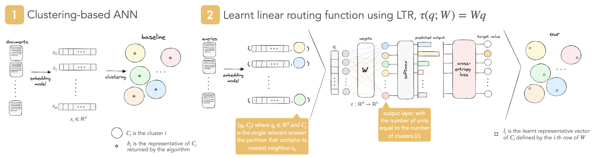
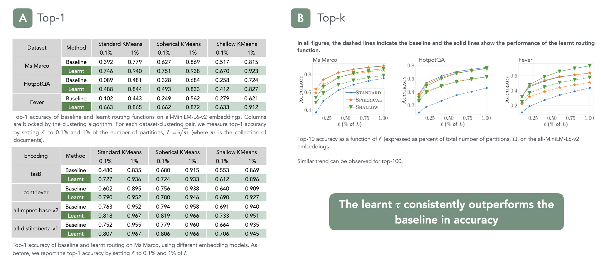

# A Learning-to-Rank Formulation of Clustering-Based Approximate Nearest Neighbor Search

This is the official code implementation for SIGIR 2024 paper
"[A Learning-to-Rank Formulation of Clustering-Based Approximate Nearest Neighbor Search](https://arxiv.org/abs/2404.11731)", 
Thomas Vecchiato, Claudio Lucchese, Franco Maria Nardini, Sebastian Bruch.

> **Learning cluster representatives using Learning-to-Rank improves ANN search accuracy.**

### Methodology


### Results


---
## Installation

Installing and executing the scripts in this package are fairly straightforward.
All you must do is to install a Python version greater than or equal to 3.9, create a virtual environment and 
install the dependencies written.


- **Virtual Environment**
```bash
python -m venv ./mips-venv
source ./mips-venv/bin/activate
```

- **Libraries**
```
numpy~=1.24.4
h5py~=3.8.0
absl-py~=1.4.0
tabulate~=0.9.0
tqdm~=4.65.2
torch~=2.2.0
scikit-learn~=1.4.0
pandas~=2.1.4
tensorflow~=2.15.0
faiss-cpu~=1.7.4
```

---
## Running the code

<p align="justify">
    With the environment ready, the next step is to select a dataset and run an embedding model, in order to have
    for each doc and query the dense vector representation.
    Finally, before running the code, the last passage, is to have for each query its nearest neighbor, 
    which can be obtained by running the MIPS (Maximum Inner Product Search) between the query and each doc 
    in the collection.
</p>


The dense vectors and the nearest neighbors can be saved either in a `hdf5` or in a `npy` format.


- **hdf5**

```bash
python main_mips.py \
    --name_dataset ${DATASET_NAME} \
    --name_embedding ${EMBEDDING_NAME} \
    --format_file hdf5 \
    --dataset ${DATASET_PATH} \
    --algorithm kmeans|kmeans-spherical|random \
    --nclusters ${NUM_CLUSTERS} \
    --top_k ${TOP_K} \
    --test_split_percent 20 \
    --split_seed 42 \
    --ells ${nprobe} \
    --learner_nunits 0 \
    --learner_nepochs ${NUM_EPOCHS} \
    --compute_clusters 0|1
```

- **npy**

```bash
python main_mips.py \
    --name_dataset ${DATASET_NAME} \ 
    --name_embedding ${EMBEDDING_NAME} \ 
    --format_file npy \
    --dataset_docs ${DATASET_DOCS_PATH} \
    --dataset_queries ${DATASET_QUERIES_PATH} \
    --dataset_neighbors ${DATASET_NEIGHBORS_PATH} \
    --algorithm kmeans|kmeans-spherical|random \ 
    --nclusters ${NUM_CLUSTERS} \ 
    --top_k ${TOP_K} \ 
    --test_split_percent 20 \
    --split_seed 42 \
    --ells ${nprobe} \
    --learner_nunits 0 \
    --learner_nepochs ${NUM_EPOCHS} \
    --compute_clusters 0|1
```

`name_dataset` and `name_embedding`: simple reference names for the embedding model and the dataset used;
`format_file`: _hdf5_ or _npy_;
`dataset`: path to the dataset in hdf5 format where we can find the vector representation of docs, the vector 
representation of queries and the nearest neighbor for each query;
`dataset_docs`: path to the vector representation of docs in npy format;
`dataset_queries`: path to the vector representations of queries in npy format;
`dataset_neighbors`: path to the nearest neighbor for each query in npy format;
`algorithm`: clustering algorithm used to partition documents - in particular we have: 
_kmeans_ for Standard KMeans, _kmeans-spherical_ for Spherical KMeans, _random_ for Shallow KMeans;
`nclusters`: number of clusters;
`top-k` : top-k documents to retrieve per query;
`test_split_percent`: percentage of data points in the validation and test set;
`split_seed`: random seed used;
`ells`: top-l partitions to examine;
`learner_nunits`: number of hidden units used by the linear-learner model - in our case is equal to 0;
`learner_nepochs`: number of epochs to train the linear-learner model;
`compute_clusters`: equal to 1 if we want to execute the entire code, otherwise by setting it to 0 we resume the
partitions and the representatives of each partition already computed by a given clustering algorithm in a previous
execution.


The final results can be viewed in the terminal and are saved in a txt file.

In case you want to save the new learnt representatives, you just need, for example, to insert the following snippet 
of code in line 315 of the `main_mips` Python file:

```python
np.save('learnt_representatives.npy', new_centroids)
```

### Example

```bash
python main_mips.py \
  --name_dataset msmarco \
  --name_embedding allmini \
  --format_file hdf5 \
  --dataset msmarco_allmini.hdf5 \
  --algorithm kmeans \ 
  --nclusters 3000 \ 
  --top_k 1 \
  --test_split_percent 20 \
  --split_seed 42 \
  --ells 1,3,6,12,18,24,30,60,90 \
  --learner_nunits 0 \
  --learner_nepochs 100 \
  --compute_clusters 0
```

---

## Citation

If you find it useful, please consider citing the following paper:
```
@inproceedings{Vecchiato_2024, series={SIGIR 2024},
   title={A Learning-to-Rank Formulation of Clustering-Based Approximate Nearest Neighbor Search},
   url={http://dx.doi.org/10.1145/3626772.3657931},
   DOI={10.1145/3626772.3657931},
   booktitle={Proceedings of the 47th International ACM SIGIR Conference on Research and Development in Information Retrieval},
   publisher={ACM},
   author={Vecchiato, Thomas and Lucchese, Claudio and Nardini, Franco Maria and Bruch, Sebastian},
   year={2024},
   month=jul, collection={SIGIR 2024} }
```
